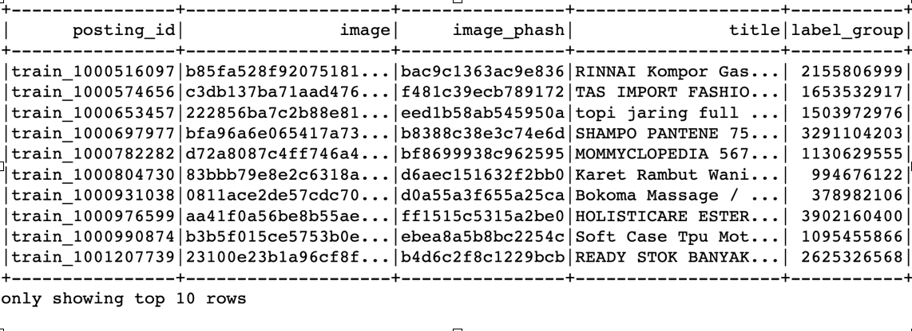
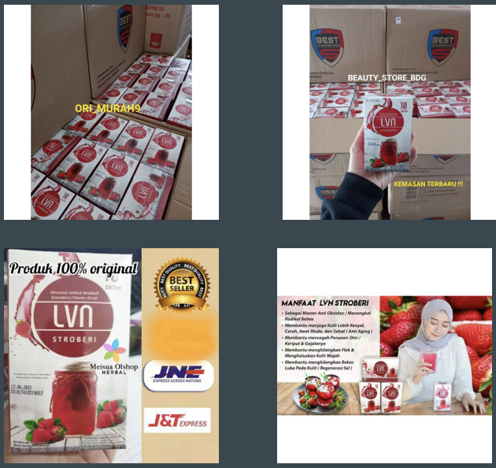
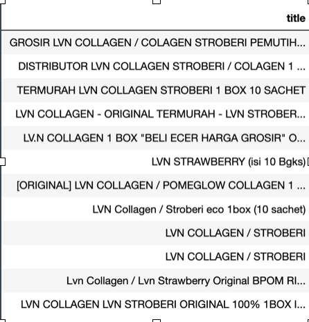
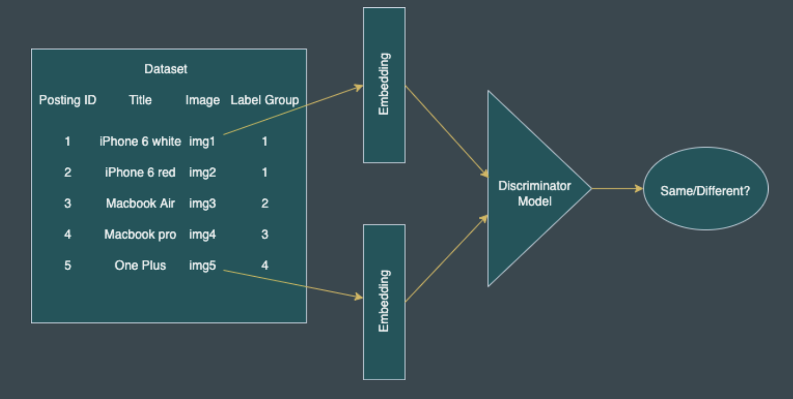

# product deduplication

The goal of this project was to identify similar products listed on any e-commerce website using the image of the product and its description.

E-commerce websites have products that are sold by multiple sellers. Each seller can upload different images and descriptions of the same product. These images and descriptions can be highly diverse. Identifying these duplicates is essential to improve user experience as well as to optimize resources. The goal of this project is to identify duplicated products among ~33k products sold by multiple sellers on Shopee.

As the dataset has more than ~11k distinct class labels of products,multiclass classification model wasn’t feasible. The solution implemneted is based on finding similar products(deduplication) by different approach of vector embeddings of products. To achieve this, Transfer Learning was implemented in which images were initially converted to embeddings using pretrained model like VGG-11 and Resnet. A model was then trained on these embeddings to classify them as same or different

**Datasets used**

We use a combination of 2 sources to obtain this data:

  - Kaggle Shopee competition data
    - ~ 32500 observations

  - Data scraped from ebay
    - ~ 6000 observations

Each observation has 	

  - Each observation has the following attributes:
    - Image (1000 x 1000 RGB image)
    - Product description
    - Label Group (unique product ID)
    - Posting ID (unique observation ID)
    - Image pHash

**Dataset**

The images and descriptions shown here all belong to the same product

**Modelling Approach**

Make meaningful vector representations of each product. This is achieved by using
   - Embeddings of title text
     - TFIDF
     - RoBERTa (Multilingual)

   - Embeddings of image
     - ResNet18

   - Joint Embeddings (text + image)

**Supervised Models Approach**

   - Pair Classification:
     - Make pairs of observations
       - Arrange some of the pairs to be from matching products (positive pairs)
       - Remaining pairs from non-matching products (negative pairs)
       - 1:1 Negative Sample is selected for maintaining class balance.

     - Train a binary classification model to take a pair and predict whether both observations belong to the same unique product or not.

     - Cosine Similarity (used in Logistic) is calculated for all pairs and set as feature for model to find right distance. 

     - The models can be:
       - Logistic regression
       - Neural Network

     - For any new observation, compare it with K nearest observations and classify.

**Modelling Approach**

   - Using these representations, we can approach the problem in 2 ways:
     - Find Nearest Neighbors and choose majority class
     - Classify pairs of observations into ‘same product’ vs ‘different products’

   - Nearest neighbors approach:
     - Given an observation, find its (approximate) K nearest-neighbors using Locality Sensitive Hashing techniques:
       - BucketRandomProjection LSH
       - MinHash LSH

     - Out of these K neighbors, choose the most frequent product class.

**Experiments and results**

   - Neural Networks:
     - Architecture:
       - Layers:
         - Linear
         - Batch Normalization

       - Activation Functions:
         - Sigmoid
         - Rectified Linear Unit activations (ReLU)
         - Leaky ReLU

       - Binary Cross-Entropy loss function (with logits)

     - Hyperparameters:
       - Learning rate: [0.1, 0.001, 0.0001]
       - Batch Size: [8, 16]
       - Weight decay: [0, 10-4, 10-2 ]
       - Early Stopping (limit of 4 non-improvement epochs)

     - Results:
       - Best Hyperparameters found:
         - Learning Rate: 10-5
         - Batch size 16
         - Weight Decay 0.0001

       - Best performance:

         - |Dataset|Loss|Accuracy|
           |-------|----|--------|
           |Training|0.60|0.57|
           |Validation|0.61|0.66|

   - Logistic Regression:

     a. Architecture:  
       - Cluster:
         - Group-3 GPU- 64GB, 16 Cores, DBR 10.3 ML,Spark 3.21
         - Since embeddings were computationally expensive to run(~800 features)		
    	ii.  Algorithms for word Embeddings:
         - Spark NLP - version: 3.4.2
         - BERT - Roberta- Multilingual Embeddings  
         - Cosine Similarity
	
     b.	Parameters:
        - regParam = 0.01
        - maxIter = 10	

     c. Results:
        - |Dataset|Accuracy|
           |-------|--------|
           |Training|0.659|
           |Validation|0.657|

   - Experiments and results

     a. Architecture: 
        - Cluster:
          - Group-3 GPU- 64GB, 16 Cores, DBR 10.3 ML,Spark 3.21

     b. Algorithms Used:
        - Resnet18 Embeddings
        - TFIDF for word features
        - Cosine Similarity
        - BucketRandomProjectionLSH
        - MinHash LSH

     c. Parameters:
        - K = 5

     d. Results:
        - |Methods|Dataset|Accuracy|
           |-------|----|--------|
           |TFIDF with cosine similarity Train|Training|0.52|
           ||Validation|0.44|
           |BucketRandomProjectionLSH on Resnet18 pertained image embedding|Training|0.38|
           ||Validation|0.36|
           |BucketRandomProjectionLSH on Resnet18 pertained image embedding + tfidf features Train|Training|0.83|
           ||Validation|0.74|
           |MinHash LSH on product description|Training|0.62|
           ||Validation|0.56|

